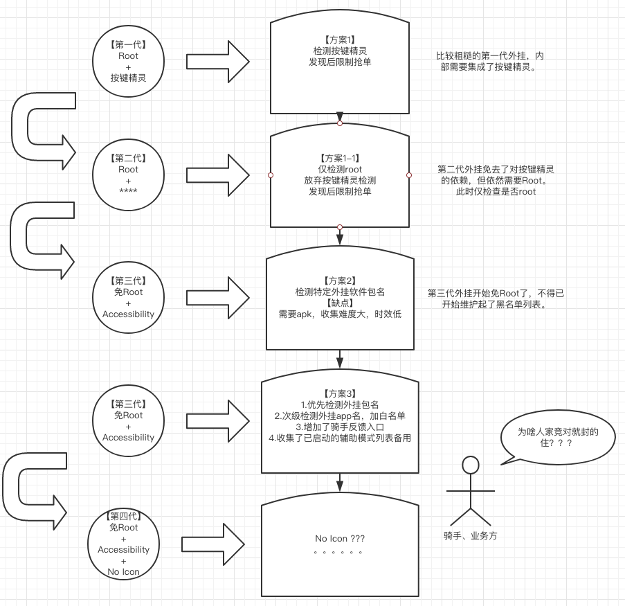
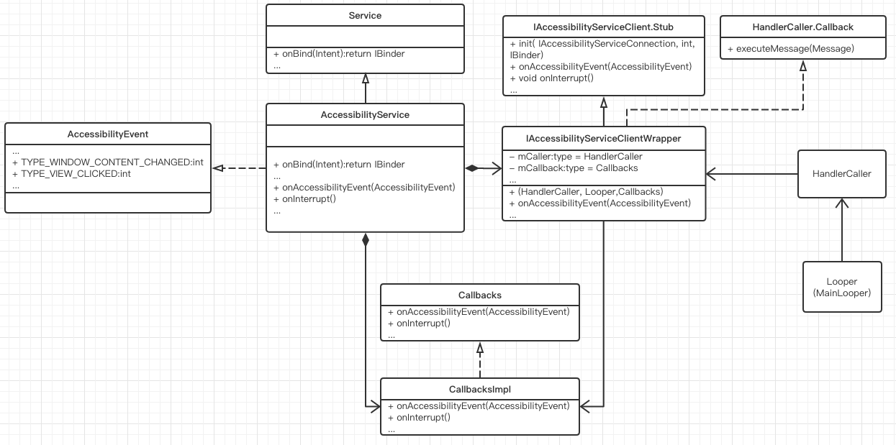
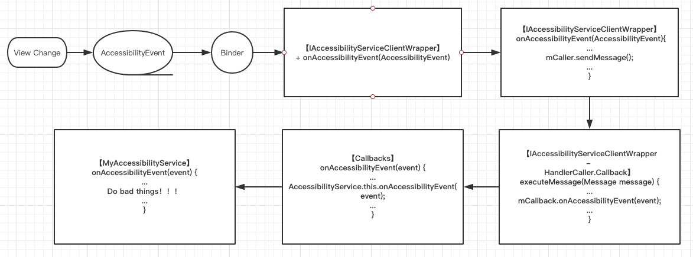
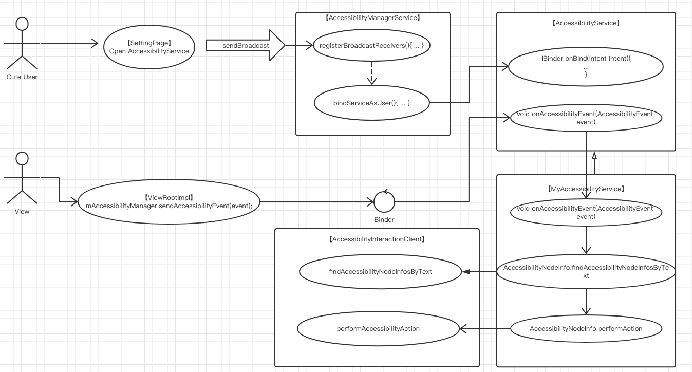
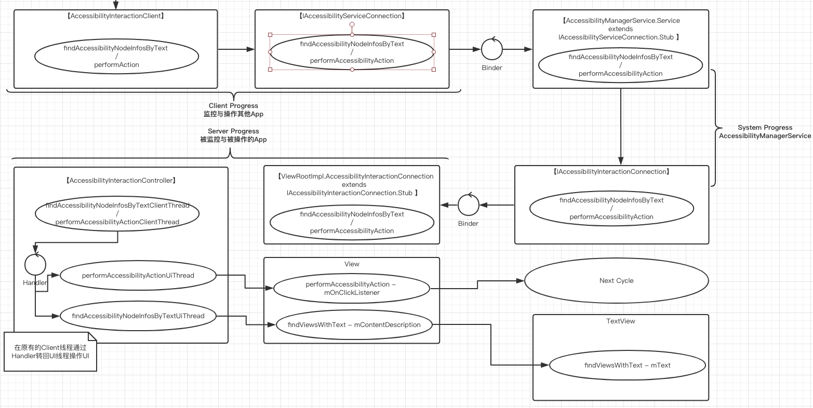

---
title: AccessibilityService分析与防御
date: 2018-1-27 16:20:58
author : 暴打小女孩

tags: RTFSC
---

转载请注明出处：https://lizhaoxuan.github.io

## 前言


提起AccessibilityService，你最容易联想到的肯定是微信抢红包插件！但这个服务的设计初衷，是为了帮助残障人士可以更好的使用App。

一些“调皮”的开发者利用AccessibilityService可以监控与操作其他App的特性加上系统远超人类的反应速度，在某些竞争类场景开发出了作弊外挂，最常见的就是你所嫉愤的微信抢红包插件了。

微信抢红包插件对原本平等的竞争环境产生了不公，不过这是微信团队要操心解决的事。可万万没想到，有一天，我正在写的App也遭此毒手！！！这都欺负到头上了能忍吗？不能啊！

OK，所以我们今天先来分析一下AccessibilityService运行原理，然后分享一些我在应对此类竞争场景下基于AccessibilityService等自动化作弊工具的防御措施。


<!-- more -->

## 外挂简史

先说下背景：

场景是和抢红包类似的另一种：抢单。用户下单后订单会经过系统，在配送端App发布，配送人员在配送端App通过距离、价钱、时间等维度进行筛选并抢单然后配送。显而易见，价高距离短的订单非常抢手，这样就形成一种竞争环境，于是，自动抢单外挂也就有了存在的理由。

然后我们来看下外挂进化史：



- 第一代外挂

	第一代外挂还比较粗糙，需要依赖按键精灵来实现，且需要Root权限。
    
    【防御】简单反编译拆包了解后，考虑暂时没有更好的办法禁止按键精灵对App的模拟点击，直接封禁Root可能会有大量误杀，第一代防御仅简单的检查是否安装了按键精灵，然后限制用户抢单。
    
- 第二代外挂

	可能因为第一代的防御过于粗糙，第二代外挂很快有了新的改进，不再需要单独安装按键精灵这个App，他们把按键精灵集成到了自己的app里……
    
    【防御】此时团队内部简单商量后决定，快刀斩乱麻，直接封禁Root权限，检测到Root后将限制抢单。
    
- 第三代外挂

	禁止Root后终于消停了一段时间，但显然人民群众的智慧是无限的，很快新的免Root外挂出世了……经过反编译外挂后，第三代外挂采用了AccessibilityService来实现。
    
    【防御】此时已知的外挂并不多，所以除了继续封禁Root以外，还建立了可远程配置的外挂package name黑名单列表，若检测到已安装app列表里存在特定外挂包名后，将会进行抢单限制。
    package name需要先获取到安装包来查看包名，随着外挂数量逐步上涨，外挂安装包获取难度大的缺点开始暴露了。
    
- 【第三代防御】
	
    此时针对上一个版本的防御措施做了一次优化：
    1.优先检查外挂package name
    2.次级检测外挂app name，加package name白名单防误判。这样就不需要再获取app的安装包了
    3.增加骑手举报反馈入口
    4.收集了已启动的辅助模式列表备用（本想再快到斩乱麻的禁止辅助模式的开启，但这个误杀范围实在是太大了，最终还是停留在了想一想的阶段）

- 第四代外挂

	在通过app name封禁后，外挂们挣扎了几次都被即时遏制了。但很快，我们收到了最新的外挂信息：新出来的外挂没有图标，看不到名字…… （你们厉害你们厉害！！！）
	
    
**哎呀~真是活久见，两波从来没见过的人在互相进步啊这是！！！禁止外挂安装这种简单的防御措施已经挡不住这帮疯狂的人类了，我只能一头扎进了AccessibilityService的源码中，看这到底是个啥东西，然后去思考相应的防御方案。**

## AccessibilityService运行原理

### AccessibilityService内部运行

这不是一篇AccessibilityService教程文章，没有AccessibilityService完整的使用示例代码和源码，但为了上下文不至于断档太大，我们这里还是会简单贴一些小段代码。同时需要说明的是，严谨的来说AccessibilityService只是一个Service，文本查找点击事件等操作对于一个Service来说是完全没法做到的。但为了行文方便，所以后面某些AccessibilityService代指辅助模式服务。

```
public class MyAccessibilityService extends AccessibilityService {

	...
    
    @Override
    public void onAccessibilityEvent(AccessibilityEvent accessibilityEvent) {
        //获取eventType
        int eventType = accessibilityEvent.getEventType();
        if (eventType == AccessibilityEvent.TYPE_VIEW_CLICKED) {
            AccessibilityNodeInfo nodeInfo = getRootInActiveWindow();
            if (nodeInfo != null) {
                //查询文案为BUTTON3的View
                List<AccessibilityNodeInfo> button3 = nodeInfo.findAccessibilityNodeInfosByText("BUTTON3");
                nodeInfo.recycle();
                for (AccessibilityNodeInfo item : button3) {
                    //对这个View执行点击操作
                    item.performAction(AccessibilityNodeInfo.ACTION_CLICK);
                }
            }
        }
    }
    
    ...
}
```

AccessibilityService真的很简单，只要写一个Service继承AccessibilityService，然后还有其他一些配置，之后每当你监控的应用界面有变动时就会回调到这个onAccessibilityEvent这个方法，你可以在里面取得此时变动的event类型是什么，还能拿到当前这个应用可视化的View树，然后取得其中的某个View来执行某些操作。

那至于其原理，用屁股想想也知道是肯定是被监控的App发生界面改变时通知了系统，然后系统又通知给了我们注册的Service。嗯……屁股想的没错……那App怎么通知系统的？系统又怎么通知我们的呢？

哎呀，屁股想不出来了，没关系，屁股决定脑袋，脑袋知道怎么办。这个时候我们就该钻到源码里来一探究竟了。Emmm~就先从我们继承的这个AccessibilityService为入口进行研究吧！


哎呀~RTFSC，这乱糟糟的一片源代码催眠的一把好手，我们还是不看了，我给你画个图吧……

我理出一份AccessibilityService类图：



乍一看好像乱糟糟的，没事，我慢慢给你絮叨，肯定比直接看源码来的直观有意思。

1.AccessibilityService有两个抽象方法，`onAccessibilityEvent()`和`onInterrupt()`，就是我们要自己实现的那两个，重点记`onAccessibilityEvent()`，它会出现很多次，我们姑且先命名它为`AS-onAccessibilityEvent()`.`onAccessibilityEvent()`的参数类型是`AccessibilityEvent`,这个类简而意之就是当系统中发生某些事件时，会发送这个类的对象来告知监控方，通过这个对象可以知道是什么类型的事件、什么控件发出来等等。

2.另外`AccessibilityService`继承了`Service`，但它仅复写了`onBind`方法。在`onBind`方法中return了一个`IAccessibilityServiceClientWrapper`对象。

```
@Override
public final IBinder onBind(Intent intent) {
        return new IAccessibilityServiceClientWrapper(this, getMainLooper(), new Callbacks() {
        ...

        @Override
        public void onAccessibilityEvent(AccessibilityEvent event) {
            AccessibilityService.this.onAccessibilityEvent(event);
        }

		...
}
```

3.`IAccessibilityServiceClientWrapper`继承了`IAccessibilityServiceClient.Stub`，嗯~看到这你应该就明白一大块了，`AccessibilityService`是一个跨进程通信Service。`IAccessibilityServiceClientWrapper`是这个类的重点关注对象了，那他作为一个AIDL的一个server端，他有哪些对外提供的方法呢？

```
interface IAccessibilityServiceClient {
    void init(in IAccessibilityServiceConnection connection, int connectionId, IBinder windowToken);
    void onAccessibilityEvent(in AccessibilityEvent event);
    void onInterrupt();
    void onGesture(int gesture);
    void clearAccessibilityCache();
    void onKeyEvent(in KeyEvent event, int sequence);
    void onMagnificationChanged(in Region region, float scale, float centerX, float centerY);
    void onSoftKeyboardShowModeChanged(int showMode);
    void onPerformGestureResult(int sequence, boolean completedSuccessfully);
}
```
这里你又看到了`onAccessibilityEvent()`,我们姑且叫他`IASC-onAccessibilityEvent()`.


4.然后我们在回头看看`IAccessibilityServiceClientWrapper`的构造方法中的三个参数，`Context、 Looper 、Callbacks`。`Context`不说了，`Looper`是一个`MainLooper`,
他们两个的作用是创建一个HandlerCaller对象,HandlerCaller你可以很粗狂的就把它当做Handler，想了解细节可以自己看一下源码：

```
public IAccessibilityServiceClientWrapper(Context context, Looper looper,Callbacks callback) {
            mCallback = callback;
            mCaller = new HandlerCaller(context, looper, this, true /*asyncHandler*/);
        }
```

5.然后我们来看看`Callbacks`是个啥：

```
public interface Callbacks {
        void onAccessibilityEvent(AccessibilityEvent event);
        void onInterrupt();
        void onServiceConnected();
        void init(int connectionId, IBinder windowToken);
        boolean onGesture(int gestureId);
        boolean onKeyEvent(KeyEvent event);
        void onMagnificationChanged(@NonNull Region region,
                float scale, float centerX, float centerY);
        void onSoftKeyboardShowModeChanged(int showMode);
        void onPerformGestureResult(int sequence, boolean completedSuccessfully);
        void onFingerprintCapturingGesturesChanged(boolean active);
        void onFingerprintGesture(int gesture);
        void onAccessibilityButtonClicked();
        void onAccessibilityButtonAvailabilityChanged(boolean available);
    }
```
这和刚才那个`IAccessibilityServiceClient`不是一样嘛？没错，是这样的，而且这里面也有一个`onAccessibilityEvent`,我们叫它`Callbacks-onAccessibilityEvent`。

上面你应该看到`Callbacks`是一个匿名内部类，他实现的`Callbacks-onAccessibilityEvent`方法的就是一句：` AccessibilityService.this.onAccessibilityEvent(event);`直接调用了`AS-onAccessibilityEvent()`，先记下来哈。


6.哦对，`IAccessibilityServiceClientWrapper`还实现了一个`HandlerCaller.Callback`接口:

```
public interface Callback {
    public void executeMessage(Message msg);
}
```

7.最后我们看一下`IAccessibilityServiceClientWrapper`对两个接口`IAccessibilityServiceClient`和`HandlerCaller.Callback`的实现：

```
...
public void onAccessibilityEvent(AccessibilityEvent event, boolean serviceWantsEvent) {
    Message message = mCaller.obtainMessageBO(
            DO_ON_ACCESSIBILITY_EVENT, serviceWantsEvent, event);
    mCaller.sendMessage(message);
}
...
@Override
public void executeMessage(Message message) {
    switch (message.what) {
        case DO_ON_ACCESSIBILITY_EVENT: {
            ...
            	mCallback.onAccessibilityEvent(event);
            ...
            }
        } return;
        ...
	}
}
...
```

我只保留了最关键的代码，我们以`onAccessibilityEvent`为线索方法捋一遍哈。当AIDL的Client端调用了`IASC-onAccessibilityEvent`时，会通过Handler发送一个message给自己，接收到以后会调用`Callbacks-onAccessibilityEvent`，`Callbacks-onAccessibilityEvent`我们刚才看过啦，会调用`AS-onAccessibilityEvent()`,这是个抽象方法，也就是我们自己实现的MyAccessibilityService中的自定义代码。

有点懵？？不明白到底在干啥？没关系，我还画了个搓搓的流程图：



当View发生改变时，会发出一个AccessibilityEvent出来，这个Event会通过Binder驱动发送给IAccessibilityServiceClientWrapper，调用他的onAccessibilityEvent(AccessibilityEvent)方法，这个方法通过Handler发送了一个Message给自己，目的是为了从Binder线程转回主线程。然后调用了`mCallback.onAccessibilityEvent(event)`，间接的调用了`AccessibilityService.this.onAccessibilityEvent(event);`，也就是我们自己实现的。

这么顺下来，AccessibilityService的内部逻辑是不就感觉很简单了？


### AccessibilityService外部运行

我们梳理了一遍AccessibilityService的内部执行逻辑后，就会触发很多新的问题，比如onBind是谁来调用的啊？为什么中间还要用Hander给自己发送一遍消息呢？当我们自己实现onAccessibilityEvent方法时会做一些点击一类的操作，这个是怎么做到的啊？

哎呀，问题好多，这个源码梳理下来肯定要睡第二觉了，我们不看了不看了，直接上图吧：



1.一个可爱的用户在设置页面启动了某个辅助模式服务
2.系统发送了一条广播到AccessibilityManagerService，收到广播后，AccessibilityManagerService绑定了我们写的AccessibilityService，就这样调用了onBind方法。AIDL的Server端准备好了~ AccessibilityManagerService是一个系统服务，由SystemService启动。

3.受到监控的App某个View发生了改变，其内部都会调用AccessibilityManager来发送event，其具体发送的对象是ViewRootImpl类来做的。
4.发出event后会通过Binder驱动调用到AccessibilityService，最终调用了我们复写的onAccessibilityEvent方法。
5.每一个View在AccessibilityService中都会被映射为一个AccessibilityNodeInfo对象，我们通过这个对象去查找具体View、触发事件，其本质是调用了AccessibilityInteractionClient类的对应方法。
6.AccessibilityInteractionClient我们在Uiautomator也经常看到。后面我们会继续单独分析，先大概说一下是个什么东西，官方注释是这样的：
*This class is a singleton that performs accessibility interaction  which is it queries remote view hierarchies about snapshots of their views as well requests from these hierarchies to perform certain actions on their views.*
*这个类是一个可以执行可访问性交互的单例对象，它查询远程视图层次结构，查看视图的快照，以及来自这些层次结构的请求，以便在视图上执行某些操作。*
7.如果利用AccessibilityInteractionClient操作正在被监控的App，比如点击按钮，那么View发生变化，又发送出一个Event，这样便形成一个循环。


	

### AccessibilityInteractionClient 操作View细节

在我们了解了AccessibilitySevice从View产生event事件发出到被辅助服务接收再操作View的一个流程之后，我们仅仅知道了事件是如何通知到AccessibilityService的，而具体是如何通过文本查找View，点击View则是AccessibilityInteractionClient来做的，那么下面我们就通过AccessibilityInteractionClient 的源码探究一下里面的秘密。

我们主要以findAccessibilityNodeInfosByText和performAccessibilityAction（ACTION_CLICK）两个方法往下追。

整体代码较为简单，基本是一条线往下调用的逻辑，所以我又画了一张图：



1.AccessibilityInteractionClient没做什么操作，直接通过Binder调用了AccessibilityManagerService对应的方法。

2.AccessibilityManagerService最终还是通过Binder调用了ViewRootImpl对应的方法。

3.ViewRootImpl仅作为Binder中的服务端接收调用，真正的操作交给AccessibilityInteractionController来做。

4.AccessibilityInteractionController对应的方法被调用之后，并没有直接进行操作，而是通过Handler做了一次转发，以便从Binder线程转到UI线程。

5.以performAccessibilityAction（ACTION_CLICK）点击事件为例，最终调用的实际是View的mOnClickListener。

6.以findAccessibilityNodeInfosByText为例，最终调用的实际是View的findViewsWithText方法，其方法内部实际对比的值是mContentDescription。需要特别说明的是TextView重写了该方法，其内部实际对比的值是mText。


### 小结

我们既然已经了解了AccessibilityService的运行原理，其内部就是一个跨进程通信，没什么神秘的。最终操作View的是AccessibilityInteractionClient，AccessibilityInteractionClient是怎么操作的通过源码很容易的追到了View层具体的实现，那么做防御的话简直是手到擒来！

## AccessibilityService防御

### 1.检测 or 禁止相关外挂的辅助模式开启

之前在外挂防御上，一直困扰我的一个问题是：AccessibilityService类似一个解耦很开的观察者模式，作为被观察者无法察觉到观察者究竟有哪些，这导致我们非常的被动。

不过研究过AccessibilityService源码之后，我们知道，每个AccessibilityService在都是由AccessibilityManagerService注册的，那岂不是说我们可以通过AccessibilityManagerService取得所有以安装或以启动的辅助模式应用？那么AccessibilityManagerService有提供相关方法吗？
有的：

AccessibilityManagerService.java

```
public class AccessibilityManagerService extends IAccessibilityManager.Stub {
	...
 	@Override
    public List<AccessibilityServiceInfo> getInstalledAccessibilityServiceList(int userId) {...}
}
```

值得注意的是，这个方法帮我们筛去了UiAutomationService。返回值AccessibilityServiceInfo是AccessibilityService的一些配置信息，其中包含我们最关心的packageNames(AccessibilityService 监控哪些package发出的Event)

这里有一个小问题，AccessibilityManagerService是com.android.server.accessibility包下的类，我们没有办法直接使用。不过没关系，你可以通过AccessibilityManager来间接的操作AccessibilityManagerService，其内部利用Binder间接的调用了AccessibilityManagerService，得到List<AccessibilityServiceInfo>之后，你可以通过遍历了解到自己的应用正在被那些辅助模式监控或“辅助”。

具体方法如下：

```

/**
 * 取得正在监控目标包名的AccessibilityService
 */
private List<AccessibilityServiceInfo> getInstalledAccessibilityServiceList(String targetPackage) {
    List<AccessibilityServiceInfo> result = new ArrayList<>();
    AccessibilityManager accessibilityManager = (AccessibilityManager) getApplicationContext().getSystemService(Context.ACCESSIBILITY_SERVICE);
    if (accessibilityManager == null) {
        return result;
    }
    List<AccessibilityServiceInfo> infoList = accessibilityManager.getInstalledAccessibilityServiceList();
    if (infoList == null || infoList.size() == 0) {
        return result;
    }
    for (AccessibilityServiceInfo info : infoList) {
        if (info.packageNames == null) {
            result.add(info);
        } else {
            for (String packageName : info.packageNames) {
                if (targetPackage.equals(packageName)) {
                    result.add(info);
                }
            }
        }
    }
    return result;
}
```

- **需要特别说明的是：**当info.packageNames为null时，表示监控所有包名。外挂有可能蒙混其中，但如果一刀切，也有可能误杀正常软件。
- getInstalledAccessibilityServiceList获取所有已安装的AccessibilityService,AccessibilityManager还有一个方法getEnabledAccessibilityServiceList,取得所有已经开启的AccessibilityService，用法同上。但要注意的是。检测外挂肯定是在某个节点进行，比如我们的App初次启动，那么用户可以在启动App后再启动外挂，这将是一个漏洞。

### 2.Event干扰

我们一直知道AccessibilityServices在监控目标app发出的AccessibilityEvent，从而对应的作出某些操作。

例如某些微信红包插件会监控Notification的弹出，那么我们是否可以随意发送这样的Event出来，从而混干扰外挂插件的运行逻辑？

没错，可以这样做的，具体方式如下：

``` 
textView.sendAccessibilityEvent(AccessibilityEvent.TYPE_NOTIFICATION_STATE_CHANGED);

```

但这个方案的缺陷是，大部分的外挂插件对特定类型的事件并不是特别感兴趣，他们仅在收到Event后检查页面上是否有某些特定的元素，从而决定是否进行下一步操作。

大部分情况下是一个比较鸡肋的措施，但也许会在某些场景起到意想不到的作用！

### 3.屏蔽AccessibilityServices文案检查

在没有探究AccessibilityServices源码之前，不了解AccessibilityServices检索文本信息原理的我们可能唯一能想到的应对措施就是将关键问题替换为图片。

这可以解决问题，但是问题替换为图片不但会有性能上的损耗，而且会丢失大部分原本TextView的兼容特性。

不过在了解AccessibilityServices源码之后，我们知道其内部核心原理就是调用TextView的findViewsWithText方法，不再需要费劲心思将文本转为图片，你需要做的仅仅是复写这个方法就够了：

```
public class DefensiveTextView extends android.support.v7.widget.AppCompatTextView {
    ...
    @Override
    public void findViewsWithText(ArrayList<View> outViews, CharSequence searched, int flags) {
        outViews.remove(this);
    }
}

```

这样AccessibilityServices文案检查将会在这个View上失效。


### 4.屏蔽AccessibilityServices点击事件

像上面一样，通过源码了解原理之后，我们知道AccessibilityServices执行点击事件最终在调用View的mOnClickListener。

那我们只需要在这上面做文章就好了，最快捷的办法是利用onTouch代替onClick。


### 5.检测 or 禁止相关外挂软件安装

上述方式无论是检测已安装的AccessibilityServices列表还是屏蔽AccessibilityServices的文本检查和点击事件，针对的都是AccessibilityServices本身。当你出台这样的方式后，确实后会让现有的外挂消停一段时间，但可以预见，很快会有基于其他自动化措施的外挂面世，比如类似按键精力一样的模拟Touch事件，图像识别等，在出现应对这些手段之前，你还是需要一些笨笨的老办法，收集已知外挂，禁止其安装。

检查方法非常简单，一句带过：设立黑名单，遍历系统内部所有已安装的app，鉴别package name 和app name。


## 结语

在拨开了AccessibilityServices源码的外衣之后，我们会发现其实它的原理真的很简单，唯一的核心是在Client  - System - Server三者之间利用Binder做跨进程通信，几乎没有太多的逻辑操作，一直在互相调用。

所以看着神奇且神秘的AccessibilityServices其实并没有什么了不起。

另外要说的是，在没了解AccessibilityServices源码之前，我们能想到的防御措施可能非常少且低效，比如原本只用复写一个方法，你却需要动态生成图片。了解源码之后，你便可以单刀直入，直切重点用最有效最简单的方式实现你想要的东西，所以阅读源码真的很重要！

最后先总结一下防御措施吧。

- 通过AccessibilityManager检测 or 禁止相关外挂的辅助模式开启
- 自定义TextView复写findViewsWithText方法，屏蔽文案检查
- onTouch替换onClick，屏蔽点击事件
- 随机发送Event干扰
- 通过PackageManager检测 or 禁止相关外挂软件安装


