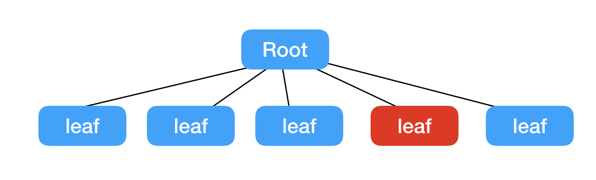
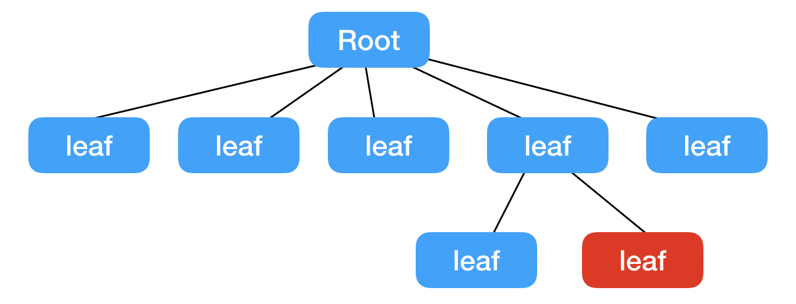

---
title: Flutter-你还在滥用StatefulWidget吗
date: 2019-1-2 16:20:58
author : 暴打小女孩

tags: Flutter
---

转载请注明出处：https://lizhaoxuan.github.io
## 前言
对于万物皆Widget的Fultter，同样的事情一般都有多种控件可以实现，太多的选择总是会让人陷入或多或少的选择纠结症和对性能的忧虑上。

初次接触Flutter，首先必然要面对的两座大山：StatelessWidget & StatefulWidget。 而在这两个控件的选择上，大部分人给出的解释就是：*"就像他们的名字一样，无状态静态的视图展示使用StatelessWidget，而有交互,需要动态变化的使用StatefulWidget."*

这样的解释正确，但过于模糊，似乎StatelessWidget出现的地方均可以用StatefulWidget来代替，于是为了后期可能的变化、为了coding简便，StatefulWidget被滥用变成了很容易发生的事情。

所以今天我们就详细聊一下StatefulWidget和StatelessWidget的区别和使用。

<!-- more -->

## StatefulWidget与StatelessWidget区别

对于普遍存在的模糊解释，想吐槽又不能说它是错的，但它确实产生了一些无解。

我个人对StatefulWidget与StatelessWidget理解：

StatelessWidget初始化之后就无法改变，如果想改变，那便需要重新创建，new另一个StatelessWidget进行替换。但StatelessWidget因为是静态的，他没有办法重新创建自己。所以StatefulWidget便提供了这样的机制，通过调用`setState((){})`标记自身为dirty状态，以等待下一次系统的重绘检查。


## StatefulWidget 动态化代价

通过定义，StatefulWidget怎么看都是一个万金油的存在，但是，我期望你能对StatefulWidget动态化所付出的代价有所了解：

**在State类中的调用`setState((){})`更新视图，将会触发State.build！** 也将间接的触发其每个子Widget的构造方法以及build方法。

这意味这什么呢？ 如果你的根布局是一个StatefulWidget，那么每在根State中调用一次`setState((){})`，都将是一次**整页所有Widget的rebuild！！！** 举个栗子：

```
class MyStatefulWidget extends StatefulWidget {
  @override
  State<StatefulWidget> createState() {
    // TODO: implement createState
    return null;
  }
}

class CustomerState extends State<MyStatefulWidget> {
  int _num = 0;

  @override
  Widget build(BuildContext context) {
    // TODO: implement build
    return Row(children: <Widget>[
      GestureDetector(
        onTap: () {
          setState(() {
            _num++;
          });
        },
        child: Text("Click My"),
      ),
      Text("1:AAAAA"),
      Text("2:BBBBB"),
      Text("3:C:" + _num.toString()),
      CustomerContainer()
    ]);
  }
}

class CustomerContainer extends StatelessWidget {
  @override
  Widget build(BuildContext context) {
  	for (int i = 0; i < 1000000; i++) {
  		print("我是一个耗时操作 for:" + i.toString());
  	}
    return Container(
      child: Text("4:DDDD"),
    );
  }
}
```

对于上面的代码，每一次点击 ”My Click“，CustomerState build方法，以及Row、Text、CustomerContainer等子Widget都将重建，暂时还不太确定在绘制上Flutter是否会有缓存优化，但大量的对象创建与方法执行是跑不了的。如果某个子Widget的构造或build进行了较为耗时的操作，那更是灾难！！！

所以，你也应该能理解新建一个Flutter工程根布局为什么是一个StatelessWidget了。


## StatefulWidget是如何实现界面更新的？

```
setState(() {
	_num++;
});
```

在接触一门新的技术时，旧技术所带来的惯性思维是很可怕的。

初次接触像上面这样`setState`的方法时，想当然的认为`State.setState((){})`实现原理应该类似于 Android 的 DataBinding 或者 Vue 的数据劫持，实现观察者模式并做定向更新，只局部更新绑定了 `_num` 的 Widget。

也正是因为抱着这样的想法，对于大量使用StatefulWidget并没有什么心理负担。

但上面的case已经很直白的告诉我们，事实并不是这样！！！

我们先看一下`State.setState((){})`源码：

```
@protected
  void setState(VoidCallback fn) {
  	...
  	_element.markNeedsBuild();
  }
```

省略了所有的assert效验，实际有意义的只有这一句，标记 element 为需要 build 状态。再往下看：

```
void markNeedsBuild() {
	...
    if (dirty)
      return;
    _dirty = true;
    owner.scheduleBuildFor(this);
}
```
标记 element 为 dirty 状态，并执行 owner 的 scheduleBuildFor 方法。owner 是 BuildOwner，看名字就知道是负责build的。

```
void scheduleBuildFor(Element element) {
	...
	if (!_scheduledFlushDirtyElements && onBuildScheduled != null) {
      _scheduledFlushDirtyElements = true;
      onBuildScheduled();
    }
    ...
}
```
 `onBuildScheduled()` 中又调用了 `ensureVisualUpdate()` 然后 `scheduleFrame()`,直接看下 `scheduleFrame `

```
void scheduleFrame() {
    if (_hasScheduledFrame || !_framesEnabled)
      return;
	ui.window.scheduleFrame();
    _hasScheduledFrame = true;
  }
```

调用了Window类的`scheduleFrame()`方法，`scheduleFrame()`是一个native方法，实现真正的界面绘制，到这里我们就基本清楚我们要知道的东西了。

Flutter并没有实现数据双向绑定，你在`State.setState((){})`中写什么代码都不重要，它仅用来标记这个State对象需要重新Build，重新build后根据已变更的数据来创建新的Widget。

```
setState(() {
	_num++;
});
```
```
_num++;
setState(() {});
```
所以这两种写法都可以实现依赖`_num`的Widget更新。


## 开发中如何选择StatefulWidget和StatelessWidget？

通过上面三个小结，你应该大致了解了StatefulWidget的视图更新是如何简单粗暴、且代价较高。

对比Vue（Vue通过双向数据绑定实现局部DOM更新以提高效率），Flutter将原本由框架负责的一些性能优化转嫁在了开发者身上。有一点类似于C++和java的内存回收。

既然反抗不了，就躺下来享受“自由”的快感吧。下面我们聊聊如何在开发中选择StatefulWidget和StatelessWidget来提高视图更新性能。

先列一些决策点：

- 优先使用 StatelessWidget
- 含有大量子 Widget（如根布局、次根布局）慎用 StatefulWidget
- 尽量在叶子节点使用 StatefulWidget
- 将会调用到`setState((){})` 的代码尽可能的和要更新的视图封装在一个尽可能小的模块里。
- 如果一个Widget需要reBuild，那么它的子节点、兄弟节点、兄弟节点的子节点应该尽可能少

另外其他需要注意的点

- 相较Android的View，Flutter Widget的构造方法可能被会执行很多次，做的事情应该尽可能的少
- Flutter Widget build方法可能会执行多次，做的事情应该尽可能的少




假设你有如上一个Widget树，红色表示的是一个将会被改变的Widget。如果按照这样的布局结构，那么每一次红色的 leaf 节点发生变化并重建，它的四个兄弟节点也会重新创建，对于这样的结构，你应该做这样的优化：



将变化的节点下放封装到一个更小的分支当中，使得它的兄弟节点尽可能的少。

我们用简单的demo来说明：BBB是静态文案、每点击一次Click My, AAA后面的数字都会加1


```
class CustomerStatefulWidget extends StatefulWidget {
  final String _name;

  CustomerStatefulWidget(this._name);

  @override
  State<StatefulWidget> createState() {
    print("TAG, CustomerStatefulWidget:" + _name + "  build");
    return CustomerState("CustomerStateA");
  }
}

class CustomerState extends State<CustomerStatefulWidget> {
  String _name;

  CustomerState(this._name) {
    print("TAG, CustomerState:" + _name + "  构造");
  }

  int _customerStatelessText = 0;

  @override
  Widget build(BuildContext context) {
    print("TAG, " + _name + "  build");
    return Container(
      margin: EdgeInsets.only(top: 100),
      color: Colors.yellow,
      child: Column(
        children: <Widget>[
          CustomerStatelessWidget("BBB", "BBB"),
          CustomerStatelessWidget(
              "AAA", "AAA:" + _customerStatelessText.toString()),
          GestureDetector(
            onTap: () {
              print("Click My");
              setState(() {
                _customerStatelessText++;
              });
            },
            child: Text("Click My"),
          )
        ],
      ),
    );
  }
}

class CustomerStatelessWidget extends StatelessWidget {
  final String _text;
  final String _name;

  CustomerStatelessWidget(this._name, this._text) {
    print("TAG, CustomerStatelessWidget:" + _name + "  构造");
  }

  @override
  Widget build(BuildContext context) {
    print("TAG, CustomerStatelessWidget:" + _name + "  build");
    if (_name == "BBB") {
//      for (int i = 0; i < 10000000; i++) {
//        print("for:" + i.toString());
//      }
      print("我是一个耗时方法，耗时2s");
    }
    return Text(_text);
  }
}

```

在我们点击Click My之后，看一下日志：

```
I/flutter (31310): Click My
I/flutter (31310): TAG, CustomerStateA  build
I/flutter (31310): TAG, CustomerStatelessWidget:BBB  构造
I/flutter (31310): TAG, CustomerStatelessWidget:AAA  构造
I/flutter (31310): TAG, CustomerStatelessWidget:BBB  build
I/flutter (31310): 我是一个耗时方法，耗时2s
I/flutter (31310): TAG, CustomerStatelessWidget:AAA  build

```

原本静态无需Rebuild的BBB，因为和AAA属于兄弟节点，在AAA发生改变时被动重绘，更糟糕的是BBB还有一个非常耗时的build方法。那么如何优化呢？

将ClickMy与AAA控件封装在一个更小的StatefulWidget当中，BBB上提至StatelessWidget

```
class WrapStatelessWidget extends StatelessWidget {
  @override
  Widget build(BuildContext context) {
    print("TAG, WrapStatelessWidget: build");
    return Container(
      margin: EdgeInsets.only(top: 100),
      color: Colors.yellow,
      child: Column(
        children: <Widget>[
          CustomerStatelessWidget("BBB", "BBB"),
          CustomerStatefulWidget("AAA")
        ],
      ),
    );
  }
}

class CustomerStatefulWidget extends StatefulWidget {
  final String _name;

  CustomerStatefulWidget(this._name);

  @override
  State<StatefulWidget> createState() {
    print("TAG, CustomerStatefulWidget:" + _name + "  build");
    return CustomerState("CustomerStateA");
  }
}

class CustomerState extends State<CustomerStatefulWidget> {
  String _name;

  CustomerState(this._name) {
    print("TAG, " + _name + "  构造");
  }
  int _customerStatelessText = 0;

  @override
  Widget build(BuildContext context) {
    print("TAG, CustomerState:" + _name + "  build");
    return Container(
      child: Column(
        children: <Widget>[
          CustomerStatelessWidget(
              "AAA", "AAA:" + _customerStatelessText.toString()),
          GestureDetector(
            onTap: () {
              print("Click My");
              _customerStatelessText++;
              setState(() {});
            },
            child: Text("Click My"),
          )
        ],
      ),
    );
  }
}

class CustomerStatelessWidget extends StatelessWidget {
  final String _text;
  final String _name;

  CustomerStatelessWidget(this._name, this._text) {
    print("TAG, CustomerStatelessWidget:" + _name + "  构造");
  }

  @override
  Widget build(BuildContext context) {
    print("TAG, CustomerStatelessWidget:" + _name + "  build");
    if (_name == "BBB") {
//      for (int i = 0; i < 1000000; i++) {
//        print("for:" + i.toString());
//      }
      print("我是一个耗时方法，耗时2s");
    }
    return Text(_text);
  }
```

我们再点一下ClickMy看下日志：

```
I/flutter (31310): Click My
I/flutter (31310): TAG,CustomerStateA  build
I/flutter (31310): TAG, CustomerStatelessWidget:AAA  构造
I/flutter (31310): TAG, CustomerStatelessWidget:AAA  build
```

 AAA的重绘不会再使得BBB被迫重绘！
 
## 结论
 
重申一下StatefulWidget使用的决策点：

- 优先使用 StatelessWidget
- 含有大量子 Widget（如根布局、次根布局）慎用 StatefulWidget
- 尽量在叶子节点使用 StatefulWidget
- 将会调用到`setState((){})` 的代码尽可能的和要更新的视图封装在一个尽可能小的模块里。
- 如果一个Widget需要reBuild，那么它的子节点、兄弟节点、兄弟节点的子节点应该尽可能少

另外其他需要注意的点

- 相较Android的View，Flutter Widget的构造方法可能被会执行很多次，做的事情应该尽可能的少
- Flutter Widget build方法可能会执行多次，做的事情应该尽可能的少

如果你的代码存在大量的StatefulWidget，快去重构啦~
 