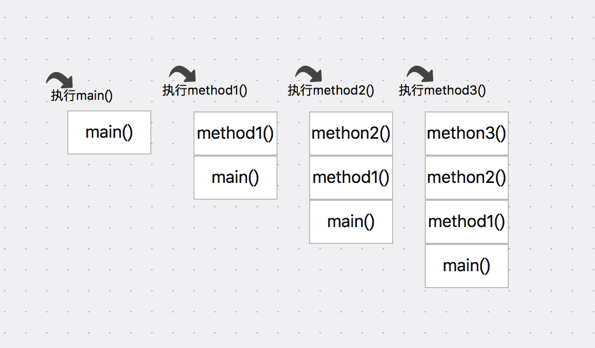
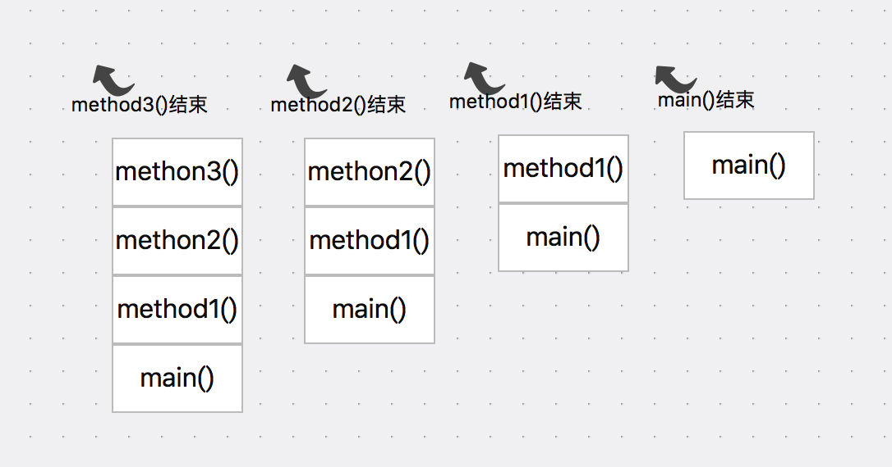

---
title: Java内存管理的一些小疑问
date: 2017-5-8 16:20:58
author : 暴打小女孩

tags: 性能优化
---

转载请注明出处：https://lizhaoxuan.github.io

## 前言


一直以来都在接受一个论调：在Java的内存管理中，基础类型变量保存在栈中，对象类型保存在堆中。
这其实是一个很粗的论调，会引起很多错误的理解。

这篇博客的产出，仅是因为脑子里偶然间冒出来的一个问题：java栈内存的内存回收是怎么做的？
因为这个问题，引发了一系列的小问题：所有的基础类型变量都保存在栈中吗？栈和堆上都在运行着我们熟悉的GC吗？怎么都感觉GC算法在栈这种结构上没法跑啊……堆内存，栈内存究竟是什么样的？


<!-- more -->

这里我非常推荐你阅读一本关于java虚拟机的书：《深入理解java虚拟机》 -- 周志明


## Java栈内存


Java栈内存的内存回收是怎么做的？似乎因为这个问题太小白了，大部分关于JAVA GC的博客都不会特别的指明，GC是运行在JAVA内存堆上的。但也是因为这个原因，对于一些基础知识不太好的小白（比如我），看多了这种博客之后，想当然的认为了GC负责了整个java内存的管理，好像~栈内存也是由GC进行回收的……（毕竟栈的全名还叫堆栈呢）

当有一天我翅膀硬了点，突然醒悟，栈这种只能在一头进出的数据结构，跑的是什么GC算法？？？如此简单的数据结构，也不需要GC了吧？

终于在查阅了很多资料后，确认了一个问题：**GC运行在JAVA堆上，负责java堆内存的回收。**

那么确认这个大前提下，后面接二连三的问题就都冒出来了：**栈内存是怎么进行内存回收的？所有的基础类型变量都保存在栈内存中吗？** 

栈嘛，仅允许在线性表的一端进行插入和删除运算，所以分配内存就在栈顶插进去一块，回收，就从栈顶取出来。

这种管理结构，从方法的角度其实很容易理解，我们看下面一段伪代码：

```
	public void main(){
    	method1();
    }

	public void method1(){
    	...
        method2();
    }
    
    public void method2(){
    	...
        method3();
    }
    
    public void method3(){
    	...
        //end
    }

```

代码很简单，main方法调用了method1,method2调用了method3，method3结束了。用图的形式更直观：

从main方法开始执行，各方法依次入栈，每个方法执行的同时，都会创建一个栈帧，然后进入虚拟机栈。


method3方法执行结束后，各方法（栈帧）依次出栈：




这就是java栈内存，用《深入理解java虚拟机》一段话来描述：

*java虚拟机栈也是线程私有的，他的生命周期与线程相同。虚拟机栈描述的是java方法执行的内存模式：每个方法在执行的同时都会创建一个栈帧用于存储局部变量表，操作数栈，动态链接，方法出口等信息。每一个方法从调用直至执行完成的过程，就对应着一个栈帧在虚拟机中入栈到出栈的过程。*

OK，到这里我们基本上可以解决第二个问题：**java栈内存的内存回收就是利用方法和栈的特性来做的！**

那么第三个问题：**所有的基础类型变量都保存在栈中吗？**

其实这个问题已经不太需要再查资料验证了，我们自己就可以分析出结果。
栈内存主要描述的是java方法执行的内存模型，一个方法内部的局部变量生命周期跟随方法的开始和结束，管理起来非常简单，所以方法内部的局部变量保存在栈中没毛病！
但是对象内部的基础类型成员变量呢？这个生命周期就比较复杂了，有明确的开始却没有明确的结束，放到栈中明显无法管理。所以，**只有方法内的基础类型变量才会保存在栈中！**

第四个问题：**我们知道栈的回收效率和速度远大于堆，为什么这一块的管理如此简单快速呢？**

继续引用《深入理解java虚拟机》一段话来描述java栈内存：

*经常有人把java内存区分为堆内存和栈内存，这种分法比较粗糙，java内存区域的划分实际上远比这发杂。这种划分方式的流行只能说明大多数程序员最关注的、与对象内存分配关系最密切的内存区域是这两块。其中所指的“栈”就是现在讲的虚拟机栈，或者说是虚拟机栈中局部变量表部分。*

*局部变量表存放了编译器可知的各种基本数据类型、对象引用和returnAddress类型。
其中64位长度的long和double类型的数据会占用2个局部变量空间（slot），其余的数据类型只占用1个。局部变量表所需的内存空间在编译期完成分配，当进入一个方法时，这个方法需要在帧中分配多大的局部变量空间是完全确定的，在方法运行期间不会改变局部变量表的大小。*

第五个问题：**如此简单高效的栈内存，会内存溢出吗？**

虽然大部分虚拟机的栈都可以动态扩展，但也并不是无限的。虽然栈溢出的情况比较小，但当有大量方法调用时非常有可能引起栈溢出，非常典型的案例就是递归调用。


## 总结

解决了两个常见的误解或没有关注的点：GC运行在栈还是堆还是两者都有；所有基本类型变量都保存在栈中吗？

java GC仅运行在堆内存上，回收效率较低。
栈内存仅描述了java方法的内存模型，每个方法所需的内存空间在编译器就已经确认，利用栈的特性完成内存分配和回收。
基础类型变量仅方法内的局部变量保存在栈内存中，成员变量保存在堆中。

虽然没有定量的标准，也没有办法得出优化前后的对比量。但在开发中，我们应该有意识的减少成员变量，如果数据可以在方法间传递，就没有必要利用成员变量做中间状态保存。同时业务开发避免方法的递归调用。


