---
title: 探索Bitmap使用姿势
date: 2017-7-11 16:20:58
author : 暴打小女孩

tags: 性能优化
---

转载请注明出处：https://lizhaoxuan.github.io

## 前言

早些时候对Android下GC调用时机比较好奇，所以写了一些case测试各种情况下Android GC调用时机与现象，感兴趣的话可以跳过去瞅瞅 ： [《Android GC机制实践调研》](https://lizhaoxuan.github.io/2016/02/17/androidgcdiaoyan/)

在这个过程中发现一个让人非常震惊的问题：从资源文件中加载一张110kb的图片创建Bitmap对象，占用的内存高达40MB！
为什么为什么为什么？？

于是这篇博客便产生了，我希望可以通过一系列测试case，来了解Bitmap在各种场景下的各种使用姿势将会在内存占用和加载速度两方面都有哪些表现，从而从中探索可能的优化点和最佳实践。


<!-- more -->

## 各种场景下创建Bitmap内存占用

### 从资源文件创建Bitmap

#### 1.不同分辨率的drawable文件夹下加载相同素材，Bitmap的内存占用大小

这里我们准备了一张117.16kb 1200*900的jpg图片放到了res/各种分辨率的drawabe目录下。对他们进行分别加载然后输出各种值进行对比，需要说明一下这里加载的意思可以是：执行`bitmapFactory.decodeResource` 。 与给ImageView设置Resource 、给布局设置背景等创建创建Bitmap或进行图片显示的操作相同。

看下实验数据


【努比亚Z9  Nubia NX508J】 分辨率1080 * 1920  像素密度：424ppi

文件夹 | getByteCount | getRowBytes | getHeight | getWidth
------ |:-------|:-------|:-------|:-------|
drawable |38880000b ≈ 37mb|14400b |2700|3600
mdip|38880000b ≈ 37mb|14400b |2700|3600
xhdip|9720000b ≈ 9mb|7200b |1350|1800
xxhdip|4320000b ≈ 4mb|4800b |900|1200


38880000b是什么概念？37MB！！
想一下，你的应用还啥都没干呢，就仅是加载了一张图片将近40MB的内存就被占用了，再加上其他一些操作，内存妥妥的就跳到临界值了，如果再有一些不当的溢出，OOM指日可待！

**似乎，图片放在分辨率越高的文件夹下，内存占用越小**


#### 2.不同格式的图片创建Bitmap内存占用大小

上面测试用的是jpg，而通常我们开发中使用的都是png，看到这么大的内存占用，我有想过是否是因为图片格式的问题，于是把这张图片丢到美图秀秀里（美图秀秀真好用），然后分别导出了长宽一样的jpg和png两张图片，放到资源文件夹中进行加载。

```
【努比亚Z9  Nubia NX508J】
drawable_jpg_1.jpg 1200*900  135.76kb
drawable_png_1.png 1200*900  1.64mb

jpg getByteCount : 38880000 getRowBytes:14400 getHeight:2700 getWidth:3600
png getByteCount : 38880000 getRowBytes:14400 getHeight:2700 getWidth:3600
```

内存占用和之前一样，并且虽然png的图片本身高达1.64mb，但内存占用依然只是37mb。

**从资源文件中加载图片的内存占用与图片格式、图片占硬盘大小无关！（但和apk包体积有关）**

#### 3.不同的分辨率的设备加载同一张素材，Bitmap内存占用大小

Android存在着很多分辨率适配问题，不同drawable文件夹也是为了适配而存在的，所以我们还要挑几个分辨率不一样的手机看一下：

【荣耀畅玩4X】  分辨率：1280 * 720   像素密度：267ppi

文件夹 | getByteCount | getRowBytes | getHeight | getWidth
------ |:-------|:-------|:-------|:-------|
drawable |17280000b ≈ 16mb |9600b |1800|2400
mdip|17280000b ≈ 16mb |9600b |1800|2400
xhdip|4320000b ≈ 4mb |4800b |900|1200
xxhdip|1920000b ≈ 2mb |3200b |600|800


诶？很明显啊，选一个分辨率低一点的手机，果然相同条件的图片加载内存占用是不一样的。我这正好还有一个和努比亚分辨率一样的手机，用这个也测一下：

【乐视 le x620】  分辨率：1080 * 1920   像素密度：401ppi

文件夹 | getByteCount | getRowBytes | getHeight | getWidth
------ |:-------|:-------|:-------|:-------|
drawable |29773800b ≈ 28mb |12600b |2363|3150
mdip|29773800b ≈ 28mb |12600b |2363|3150
xhdip|7440300b ≈ 7mb |6300b |1181|1575
xxhdip|3309600b ≈ 3mb |4200b |788|1050

问题来了，虽然分辨率是一样的，但是内存占用却不同，关键因素不在分辨率，那在什么呢？

我们都知道我们的应用程序在不同的设备上，Android系统会从不同的资源文件夹下获取图片资源，而其选择的本质不是屏幕的长宽比，是像素密度。

**所以这里的关键在于像素密度！从资源文件中加载图片的内存占用与像素密度有关！**


OK,上面的结论都是通过数据推理出来的一些表象现状。这里先进行一个小总结：

- **从资源文件中创建Bitmap，图片所在分辨率越高的drawable文件夹，Bitmap占用内存越小。（单从内存的角度可以这样考量，但从实际应用过程中，所有素材都放到分辨率最高的文件夹并不是合适的做法）**
- **从资源文件中创建Bitmap，Bitmap占用内存大小与图片宽高极为有关，与图片本身格式以及占硬盘大小无关。**
- **从资源文件中创建Bitmap，Bitmap占用内存大小与手机像素密度极为有关。**


### 从网络或本地存储创建Bitmap

通过资源文件创建Bitmap，Android系统会为了适配不同屏幕，而对图片进行一些调整，导致不同情况下内存占用区别很大。那么如果是从网络或本地存储中创建的Bitmap也会因为设备的像素密度而有很大差异吗？

我们来实验一下，我从网络下载一张图片，然后观察内存情况。

我选了一张216932b ≈ 212kb 1600 *1280 的jpg图片下载，并创建一个Bitmap

```
【努比亚Z9  Nubia NX508J 分辨率1080 * 1920  像素密度：424ppi 】
网络下载：
byte[] size : 216932 ≈ 212kb
bitmap size : 8192000 ≈ 7.8125mb
同一张图片放到资源文件中加载：
drawable getByteCount : 73728000 ≈ 70mb getRowBytes:19200 getHeight:3840 getWidth:4800
mdip getByteCount : 73728000 ≈ 70mb getRowBytes:19200 getHeight:3840 getWidth:4800
xhdip getByteCount : 18432000 ≈ 17.5mb getRowBytes:9600 getHeight:1920 getWidth:2400
xxhdip getByteCount : 8192000 ≈ 8mb getRowBytes:6400 getHeight:1280 getWidth:1600
```
Bitmap大小还是要比图片本身大出好多，而且似乎和从xxhdip文件夹下加载大小是一样的，这一个示例不足以证明是否和手机分辨率有关，我们换个手机再看看：

```
【魅族MX6 分辨率1080 * 1920  像素密度：401ppi 】
网络下载：
byte[] size : 216932 ≈ 212kb
bitmap size : 8192000 ≈ 7.8125mb
资源文件加载：
drawable getByteCount : 73728000 ≈ 70mb getRowBytes:19200 getHeight:3840 getWidth:4800
mdip getByteCount : 73728000 ≈ 70mb getRowBytes:19200 getHeight:3840 getWidth:4800
xhdip getByteCount : 18432000 ≈ 17.5mb getRowBytes:9600 getHeight:1920 getWidth:2400
xxhdip getByteCount : 8192000 ≈ 8mb getRowBytes:6400 getHeight:1280 getWidth:1600
```
好像看起来一样，不过这两台设备分辨率一样，像素密度也差不太多，还是不足以说明问题，我们找个像素密度更低一点的看一下：
```
【虚拟机-5.4FWVGA 分辨率480 * 584  像素密度：mdpi 】
网络下载：
byte[] size : 216932 ≈ 212kb
bitmap size : 8192000 ≈ 7.8125mb
资源文件加载：
drawable getByteCount : 8192000 ≈ 8mb getRowBytes:6400 getHeight:1280 getWidth:1600
mdip getByteCount : 8192000 ≈ 8mb getRowBytes:6400 getHeight:1280 getWidth:1600
xhdip getByteCount : 2048000 ≈ 2mb getRowBytes:3200 getHeight:640 getWidth:800
xxhdip getByteCount : 910364 ≈ 1mb getRowBytes:2132 getHeight:427 getWidth:533
```

哦~ 这回有点说明性了，即使在像素密度不同情况下，从网络下载的图片创建的Bitmap大小都是固定的，从资源文件中加载则因为像素密度不同会产生很多变化。

从网络直接下载得到的byte数组大小等同于原图片大小，不经处理，直接用byte创建得到Bitmap宽高会以原图片宽高创建，得到的Bitmap所占内存远大于原图在硬盘上的大小。

做个小总结：

- **从网络或本地存储加载图片创建Bitmap,内存占用仅与图片自身宽高有关，与设备像素密度无关。**
- **从网络或本地读取的byte数组大小等同于图片大小，未经处理创建Bitmap内存占用远大于byte数组大小。**


## Bitmap占用内存的大小是如何计算的？

上一节的测试case，帮助我们大概的了解了Bitmap不同场景下创建的一些特性，看起来很有道理，但case覆盖不够充足的归纳法并不足以服人。

但他确实已经激起了我们很浓厚的兴趣，所以下一步我们要通过源码来了解其中真正的原理。

Bitmap的源码解析的细节比较繁琐，有兴趣可以一层层追下去，这里就直接放结果了。

还是因为有适配的问题，所以我们还要从两个方面去说明：从网络或本地加载，和从资源文件中加载。

### 从网络或本地存储加载图片

从网络或本地加载图片不会受到设备像素密度影响，其内存占用的大小可以用下面的公式描述：

**size = 实际显示的宽 \* 实际显示的高 \* Bitmap.Config **

说到Bitmap.Config，这个又要老生常谈了，Android为图片提供了4种解码格式，不同的解码格式占用的内存大小不同，当然显示效果也不同。

Format | byte | 说明 
------ |:-------|:-------|:-------|:-------|
ARGB_8888 | 4b |此配置非常灵活，提供最好的质量。应尽可能使用。
RGB_565 | 2b |此配置可能会根据源的配置产生轻微的视觉伪影。例如，没有抖动，结果可能会显示绿色的色调。为了获得更好的效果，应该应用抖动。当使用不需要高色彩保真度的不透明位图时，此配置可能很有用。
ARGB_4444 | 2b |如果应用程序需要存储半透明信息，而且还需要节省内存，则此配置最为有用。(已废弃)
ALPHA_8 | 1b |每个像素存储为单透明（alpha）通道。这对于有效地存储掩码是非常有用的。没有存储颜色信息。通过这种配置，每个像素需要1个字节的存储器。

默认是ARGB_8888，虽然一直都在说建议不同情况使用不同的解码格式，但往往因为一些“不可抗拒”的因素，任何时候我们都在使用默认的解码格式。后面第三节会对不同的解码格式进行case测试。


### 从资源文件中加载图片

从资源文件中加载图片会受到drawble文件夹不同、设备像素密度影响，公式略微复杂一点：

scaledWidth = int(width \* targetDensity / density + 0.5f) 
scaledHeight = int(height \* targetDensity / density + 0.5f) 
size = scaledWidth \* scaledHeight \* Bitmap.Config 

width和height是原素材大小；
targetDensity 是设备像素密度；
density 是素材所在drawable文件夹大小；

这里要说明一下targetDensity 和 density 的值是怎么来的。给一个表来说明：

名称 | density |   像素密度范围:targetDensity
------ |:-------|:-------|:-------|:-------|
mdpi | 160dp | 120dp ~ 160dp
hdpi | 240dp | 160dp ~ 240dp
xhdpi | 320dp | 240dp ~ 320dp
xxhdpi | 480dp | 320dp ~ 480dp
xxxhdpi | 640dp | 480dp ~ 640dp

图片放到了哪个文件夹，density的值就是多少，如果每个文件夹都放了，Android会根据设备的像素密度自动选择对应的文件夹。

而设备的像素密度往往并不会只有160、240、320、480、640这几个，我们可以看到第一节测试数据的几个设备像素密度都是 【努比亚Z9 像素密度：424ppi】 【荣耀畅玩4X 像素密度：267ppi】  【乐视 le x620 像素密度：401ppi】

这些像素密度值是硬件的实际参数，但在系统运行时，硬件需要给Android系统提供一个准确的整数值，通常你可以粗略的将硬件实际像素密度套入上表中，去像素密度范文的最大值。但还是会有一些特殊的设备不会取标准值，比如乐视le x620的像素密度并不是标准的320dp或480dp，而是420dp。

所以设备像素密度在系统运行中的值我们可以通过下面的代码获取：

```
DisplayMetrics metric = new DisplayMetrics();
int densityDpi = metric.densityDpi;  // 屏幕密度DPI（120 / 160 / 240）
```

系统运行中取得的像素密度如下 【努比亚Z9 像素密度：480dp】 【荣耀畅玩4X 像素密度：320dp】  【乐视 le x620 像素密度：420dp】
如果素材在每个文件夹都放了图片，那么会通过上表的像素密度范围中寻找最佳的素材进行加载。

简单总结一下：

- **Bitmap消耗内存大小主要取决于实际显示的大小和每个像素所占的字节数**
- **从资源文件加载Bitmap时，还受设备像素密度与图片所在文件夹代表的像素密度之比的影响**


## 减少Bitmap的内存占用

呐，现在要进入本文的重头戏了，你当然不会看到现在网上大同小异的什么不实际加载先获取尺寸啊，各种压缩方法啊什么的说教类条目。


### 从公式引出的优化策略

第二节我们介绍了Bitmap加载占用内存的计算公式，通过公式我们可以很容易的得出一些减少Bitmap内存占用的方法。

#### 减小图片实际显示的长宽

通常来说我们要显示的图片会大于控件本身的大小，这是一种很明显的浪费，对图片做适当的压缩，贴近控件本身的大小可以有效的减少内存占用。主要用到的技术是 `BitmapFactory.Options.inSampleSize`属性，这个属性在Bitmap优化上已经被讲过无数次了，我们就不多介绍了。关键点：**按照控件本身大小加载图片**

#### 使用更合适的解码格式加载Bitmap

Android提供了四种Bitmap解码格式，每种格式占用内存的大小不一样，在合适的场景下选择合适解码格式可以有效的减少内存占用。这个虽然也是老生常谈，但里面会有一些不符合我们默认观念的东西，下面会详细介绍。

#### 为应用提供满足当前设备像素密度的素材

Bitmap内存计算公式中除长、宽、解码格式三者的乘积以外，还要乘以targetDensity与density比的平方。这是什么概念呢？

如果我们只提供了低像素密度的素材，那么在高像素密度的设备上将占用更大的内存。
反之，如果我们只提供了高像素密度的素材，那么在低像素密度的设备上将占用更小的内存。

诶？？？好像发现了什么？？是不是我们只要在xxhdpi甚至xxxxxxxhdpi中放素材，内存占用将会变得非常非常小？？这简直新大陆啊。

如果问题真的这么简单，Android系统本身也不会提供那么多像素密度的文件夹了，口说无凭，我们写个Demo看看效果。

设备信息：【虚拟机-5.4FWVGA 分辨率480 * 584  像素密度：mdpi 】
我将同一张图片分别copy在和xxhdpi文件夹下和mhdpi文件夹下，然后进行显示：
(上面xxhdpi 下面 mhdpi)
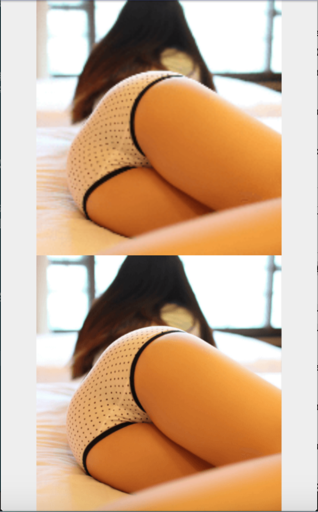

很明显的可以看出来与设备像素密度相同的mhdpi文件夹下素材显示正常，xxhdpi已经非常模糊了。

**将素材放到高像素密度文件下，以求减少内存占用是一个愚蠢的行为。**

那问题来了，为了减少apk包大小（或者是懒），大多数开发者都只会在项目中存放一套素材放到某个像素密度的文件夹下。
这样将引起的问题是：若放到低像素密度文件夹下，遇到高像素密度设备时将占用多余的内存；若放到高像素密度文件夹下，遇到低像素密度设备，素材将会变的模糊。

很痛苦对不对？所以如果对包的大小要求并没有那么严格，设定多套像素密度素材，让targetDensity与density比为1，保证显示效果与内存占用保持在最恰当的平衡才是正道。
但如果就只能用一套呢？要想办法走歪路了……

素材大部分的应用都是一些尺寸较小控件，小尺寸控件即使图片较为模糊也不会特别明显，所以这些小素材我们可以选择性忽略，是不是有点不放心？我们再跑下Demo看看效果。

设备信息：【虚拟机-5.4FWVGA 分辨率480 * 584  像素密度：mdpi 】
下面是长宽150dp的控件，上面是xxhdpi下的素材，下面是mhdpi的素材。


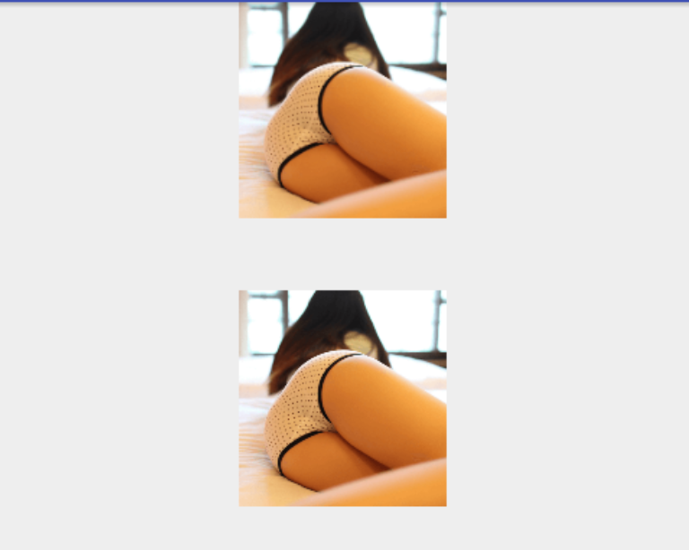

相同的设备相同的素材，缩小了控件大小后模糊的是不是不那么明显了？

那么对于大尺寸的控件呢？这里我的建议是放到assets或res/raw、中，从assets中加载图片等同于从网络或本地加载，从raw中通过InputStream加载也可以实现同样的效果，不会受到像素密度干扰。我们可以在assets中放一张相对尺寸较大的图片，然后依照控件大小加载Bitmap，在保证以最优内存占用的同时保证图片不会模糊。

当然如果图片放到了src/drawable文件夹下，通过代码` BitmapFactory.decodeStream(getResources().openRawResource(R.drawable.example));`
效果等同于放到res/raw，但这时编译器会提示这里期望的是raw类型，一条红色的波浪线总是让人难以接受且这样的图片容易被直接使用而导致上面提到问题。

将上面的代码封装到一个方法里可以避免这条红线，但还是不能避免会有其他的小伙伴直接当做资源使用这张图片。大家自己选择吧


下面我们就看看分别放到xxhdpi、assets下面的对比图。
设备信息：【虚拟机-5.4FWVGA 分辨率480 * 584  像素密度：mdpi 】
上面是xxhdpi下的素材，下面是assets的素材。


又见清晰的屁股。
当然内存占用上上面模糊的图会更小，毕竟targetDensity与density比为0.25，相当于除以4。
不过这是一种在内存占用、展示效果、Apk包大小三者间较为平和的加载方式。

此类方法适用于：全屏类型的展示素材（Splash、引导图等）、大尺寸的示例图片等。

### 不同解码格式的效果

上面我们遗留一个问题，如何使用更合适的解码格式加载Bitmap？下面就好好聊聊。

一直以来，Bitmap优化老生常谈的一个问题：使用不同的Bitmap解码格式，以降低Bitmap内存占用。但实际过程中我们都希望图片以最优的状况展示给用户，所以用的最多的是ARGB_8888.

这里我好奇的是他们之间究竟有多少差异，分别适应什么场景，我做了一些测试。

奥~测试之前，再把四种解码格式的介绍列一下吧：

- ALPHA_8模式
ALPHA_8模式表示的图片信息中只包含Alpha透明度信息，不包含任何颜色信息，所以ALPHA_8模式只能用在一些特殊场景。

- RGB_565模式
显然RGB_565模式不能表示所有的RGB颜色，它能表示的颜色数只有32 × 64 × 32 = 65536种，远远小于24位真彩色所能表示的颜色数（256 × 257 × 256 = 16677216）。当图片中某个像素的颜色不在RGB_565模式表示的颜色范围内时，会使用相近的颜色来表示。

- ARGB_4444模式
ARGB_4444已被Android标记为@Deprecated，Android推荐使用ARGB_8888来代替ARGB_4444，原因是ARGB_4444表示出来的图片质量太差。 

- ARGB_8888模式
ARGB_8888模式用8位来表示透明度，有256个透明度等级，用24位来表示R，G，B三个颜色通道，能够完全表示32位真彩色，但同时这种模式占用的内存空间也最大，是RGB_565模式的两倍，是ALPHA_8模式的4倍。

介绍是这么写的，但真实使用情况是怎么样的？我们来测试一下：

我准备了一张图片然后分别使用不同的解码格式进行解码，然后进行展示并输出Bitmap的大小：

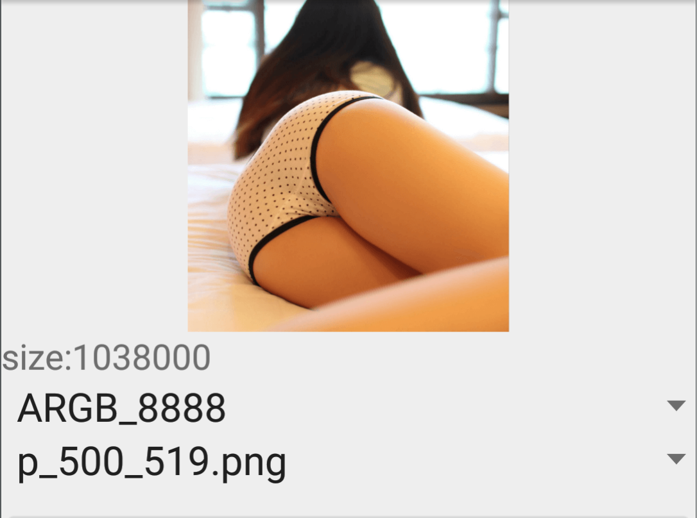

最好的解码方式展示最优的效果，当然内存占用也是最大的：1038000 ≈ 0.98mb。

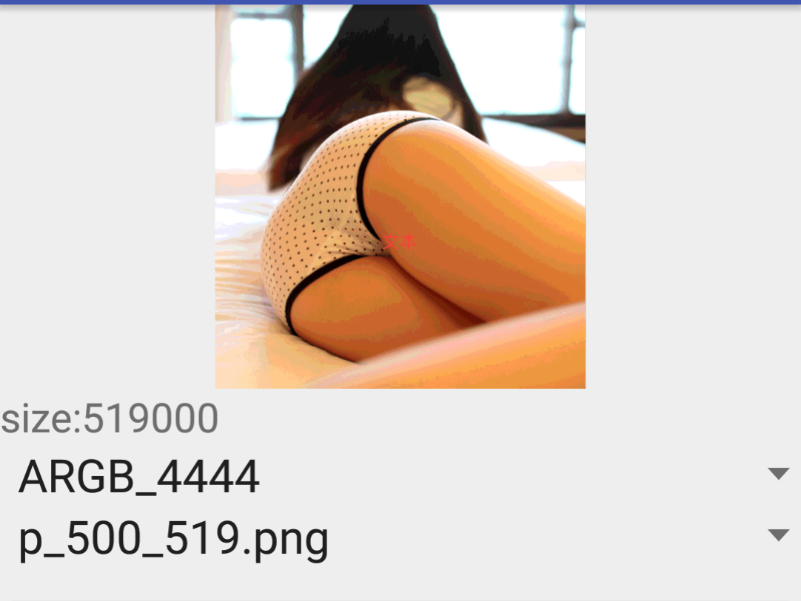

果然是要放弃的解码格式，大腿都花掉了，虽然内存占用小了将近一半，但也不能再用你了。

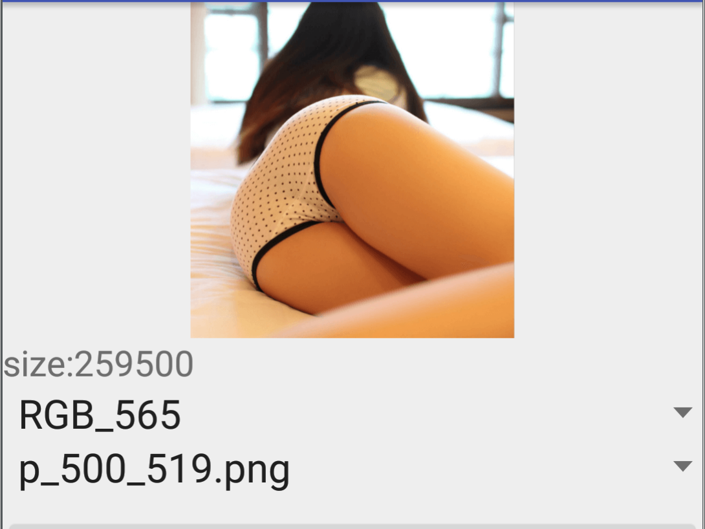

诶？这个看起来好像很不错的样子，内存占用仅有ARGB_8888的四分之一，但现实上几乎看不出什么不同，还是细腻的大腿。赞赞赞。（理论上size的大小不应该只有ARGB_4444的一半，应该是相等的，这个不能理解）


诶诶诶？？ALPHA_8这么强大吗？？？同样的几乎无损图，按照说明它应该是显示最差的啊，不是说不包含颜色的吗？。size的大小和RGB_565一样又是怎么回事？？？

好了，这里简单解释一下，前面三张图重复的展示ARGB_8888、ARGB_4444、RGB_565三种解码格式在内存占用上的不同。ARGB_4444展会效果太差已经是不用质疑的了，但RGB_565内存占用仅有ARGB_8888的四分之一，显示上却没有明显的区别，难道说可以用RGB_565完全的代替ARGB_8888吗？

不不不，当然不是这样的，我们看下RGB_565的解释：*当图片中某个像素的颜色不在RGB_565模式表示的颜色范围内时，会使用相近的颜色来表示。* 之所以我们没有感觉到特别大的区别，原因在与图片本身色调过于单一（满眼黄黄的大腿），RGB_565所能表示的颜色已经够用或者代替的颜色色差足够小。如果你需要展示色彩特别丰富的图片还是会看出区别的。

然后我们再解释一下ALPHA_8的问题。当你设置`op1.inPreferredConfig = Bitmap.Config.ALPHA_8`为某个属性时，并不是说Bitmap解码器必然使用这种解码格式，仅是优先使用这种解码格式。不包含颜色信息的ALPHA_8怎么能解码出来黄黄的大腿呢？ALPHA_8不可以，RGB_565可以。所以解码器使用了RGB_565，具体其内部的优先级和使用策略还没有具体研究。

Bitmap解码器最终使用的解码格式在很大程度上取决于图片本身。

既然上面的图片ALPHA_8没法解码，那黑白的二维码图片ALPHA_8可以解码吗？试一下：

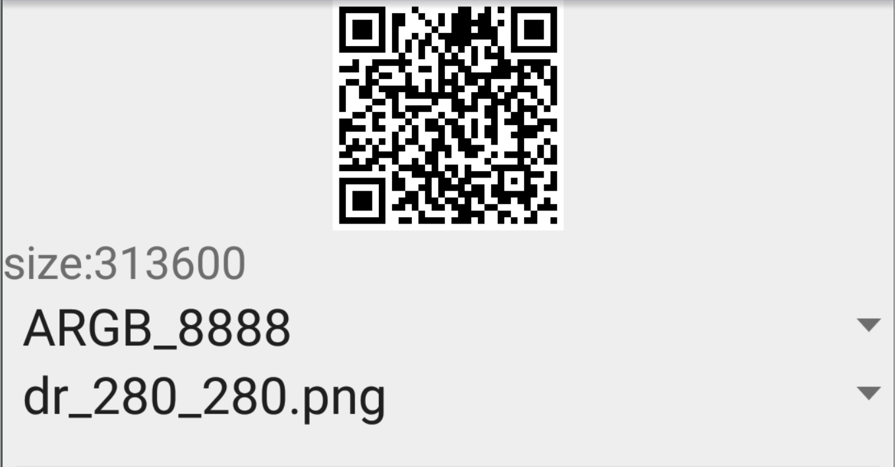

挺好的……

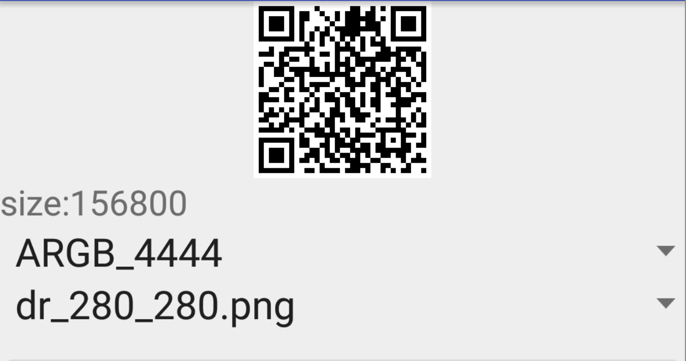

简单的二维码图片，ARGB_4444也挑不出啥毛病来……

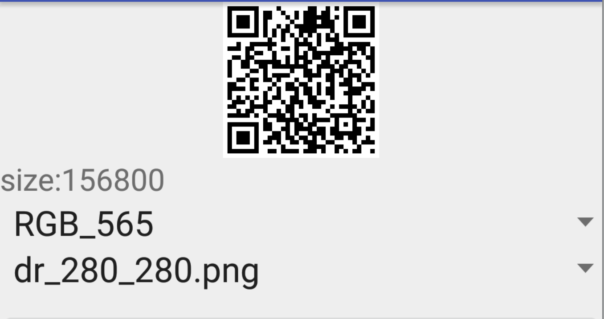

这回size的大小合理了，和ARGB_4444一样。

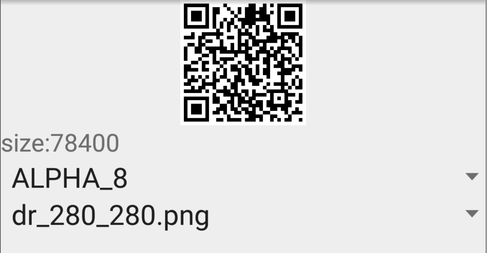

更小的size，显示效果也无不同。赞！

简单总结一下：

- 设置图片解码格式并不一定会使用这种解码格式，关键取决与图片本身。
- ALPHA_8适合类似二维码一类的简单黑白图
- RGB_565似乎可以满足大多数要求不高的展示场景

### Bitmap内存复用

通常来说我们在需要使用一张新的图片时，都会为这个重新分配一块内存,然后创建一个新的Bitmap对象，一个两个不会存在太大的问题，但当有大量的零时Bitmap对象被频繁创建时，将会引起频繁的GC。所以Google在很早之前发布的性能优化典范中推荐开发者使用`inBitmap`属性来对Bitmap做内存复用，通过该属性告知解码器尝试使用已经存在的内存区域，从而避免内存的重新分配。


当然`inBitmap`是有较大限制的，有着一定的场景依赖，所以通常被使用的频率不是很高，具体限制我们后面会有简单提到。这里我们先通过Demo测试一下`inBitmap`的复用效果。

首先我用下面的方法测试未复用Bitmap内存的情况下，在一个ImageView依次显示三张图片时内存占用情况：

```
private void unRecycle() {
        byte[] welcome1 = Tool.readFile(this, bitmapPaths[index++]);
        imageView.setImageBitmap(BitmapFactory.decodeByteArray(welcome1, 0, welcome1.length));
        if (index >= 3) {
            index = 0;
        }
    }
```

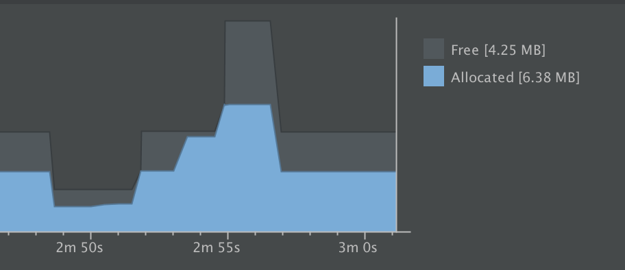

通过内存监控可知，三张图片依次加载时，内存成阶梯状上升，执行GC后，内存成断崖式下跌。在实际使用过程中，很可能因为内存无法即时回收而导致OOM，或因为大量内存需要回收而引起卡顿。

然后我们在用下面的方法测试复用Bitmap内存的情况下，在一个ImageView依次显示三张图片时内存占用情况：

```
byte[] welcome1 = Tool.readFile(this, bitmapPaths[index++]);
        if (bitmap == null) {
            BitmapFactory.Options option1 = new BitmapFactory.Options();
            option1.inMutable = true;
            bitmap = BitmapFactory.decodeByteArray(welcome1, 0, welcome1.length, option1);
        } else {
            BitmapFactory.Options option1 = new BitmapFactory.Options();
            option1.inBitmap = bitmap;
            option1.inMutable = true;
            bitmap = BitmapFactory.decodeByteArray(welcome1, 0, welcome1.length, option1);
        }
        imageView.setImageBitmap(bitmap);
        if (index >= 3) {
            index = 0;
        }
```

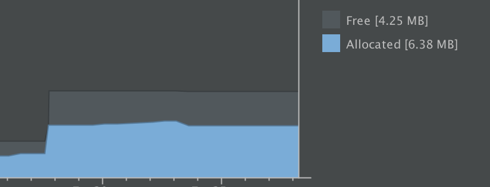

通过内存监控可知，仅在第一张图片加载时，系统分配了一块内存给Bitmap，后面两张图没用再重新进行内存分配。避免了大块内存的重新分配和GC回收。

### Bitmap复用场景实操 - 拍照后图片加载与显示的优化对比

这里介绍一个最简单的适合使用`inBitmap`属性的场景：拍照！

设备：【努比亚Z9 像素密度：480dp】
Demo的界面很简单，一个ImageView用来展示图片，初次进入默认展示示例图片，点击拍照按钮调用系统相机进入拍照界面，成功拍照后将照片展示到ImageView上,可多次拍照，ImageView仅展示最新照片。

**这里我们考察的点是，进入Activity后进行多次拍照，然后观察内存变化。主要关注示例图片的内存占用与拍照后的内存占用。**
下面是Demo的界面展示，优化前后界面展示保持不变。考虑篇幅问题，这里不再贴代码，仅以文字描述，详细代码可以查看[Demo代码]()。

 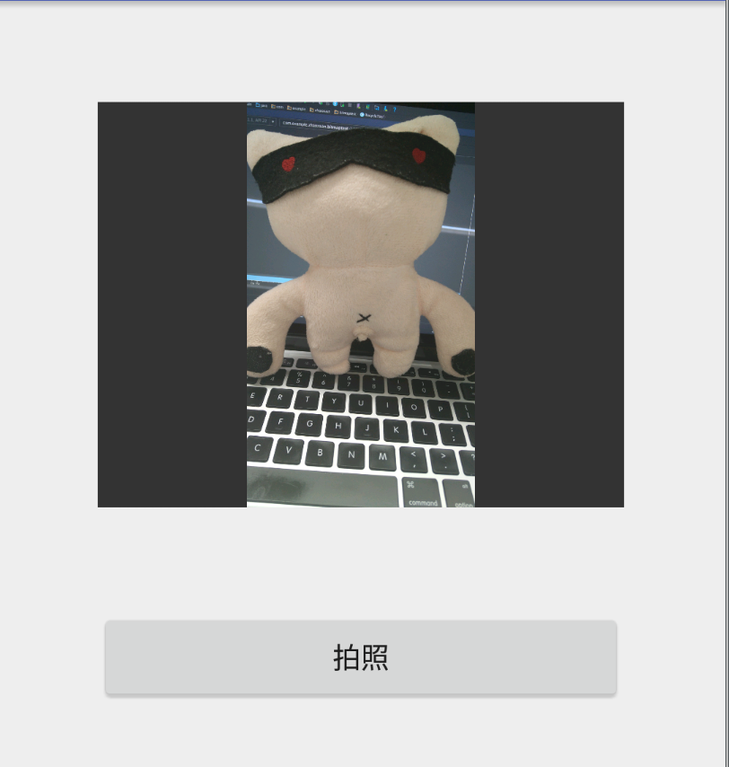


#### 老的拍照操作
先说我们通常最普通的做法，仅做了简单的拍照后图片压缩显示。

1.示例图片放在src/xhdpi文件夹下，通过`photoImg.setImageResource(R.drawable.example);`设置。
2.拍照后将图片保存为本地文件，在`onActivityResult`回调方法中。以默认长宽1024x768为标准进行压缩，通过`BitmapFactory.decodeStream`创建Bitmap。（默认长宽通常为UED给出的设计稿尺寸）。

然后我们看一下Demo跑起来以后的的内存监控图：

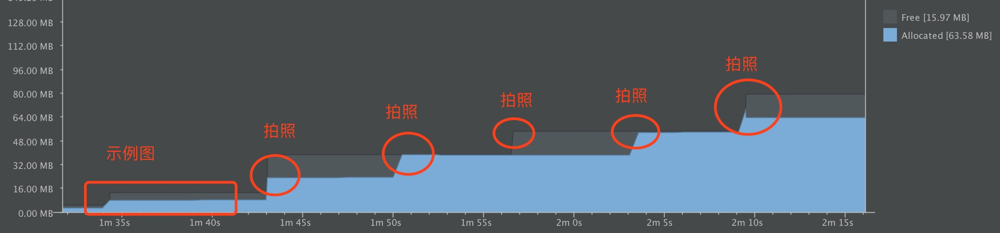

解释一下：

1.第一个内存上升主要是因为页面进入后，加载示例图造成的，大约占用内存8MB左右。src/xhdpi与本次测试的设备像素密度相同，如果xxhdpi像素密度的设备，内存占用更大；如果遇到像素密度更小的设备，则示例图可能会变得模糊。

2.圆圈表示拍照后内存的上升，每一次拍照都将创建一个新的Bitmap，大约占用内存9MB左右。

3.观察第三个圆圈，系统发生一次GC，系统回收一个Bitmap，但显而易见并没有回收干净。

4.观察第五个圆圈，出现一次内存尖峰，再次发生GC，但同样没有回收干净，内存整体呈持续持续上升趋势。

总结：内存并没有泄露，五次拍照均产生的为临时变量，但大内存的占用导致GC回收非常不干净。在实际使用中，未被即时回收的内存将可能导致OOM。
即使不会引起OOM，大块内存分配引起的GC同样极易引起界面卡顿，GC运行在主线程。


#### 新的拍照操作

针对上面老的拍照操作，新的拍照操作主要做了如下优化：

1.不在直接通过`photoImg.setImageResource(R.drawable.example);`设置图片，改为` BitmapFactory.decodeStream(getResources().openRawResource(srcId), null, options);`。 提高Bitmap加载速度的同时（decodeStream直接调用JNI方法），跳过Android系统针对设备像素密度对图片做的优化，直接对图片本身进行操作。

2.以`Config.RGB_565`解码格式进行解码，缩小Bitmap一半内存占用。

3.以ImageView实际大小为标准对示例图与照片做压缩。

4.对多次拍照产生的Bitmap做复用，最终实际仅占用一个Bitmap内存。

我们看下优化后的内存监控图：

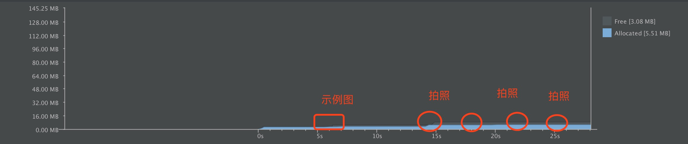

内存曲线过于平缓……看的不太清晰……

1.示例图因为经过压缩，且跳过像素密度的适配，最终仅占用约0.3MB内存。

2.因为示例图与压缩后的照片尺寸不一样，不能进行Bitmap复用，所以第一次拍照后又创建了一个Bitmap，大约占用内存1.9MB，之后多次拍照复用第二个Bitmap，没有进行内存分配，所以也没有GC发生。


##### 总结

优化结果很明显啦~
主要的优化点：

- 跳过像素密度适配直接通过 `decodeStream`对图片进行加载。
- 按照控件大小加载图片。
- 对Bitmap进行复用。

但里面会有一些坑点：

- 在Activity没有将界面完全展示时，无法获取控件宽高。此类场景如何获取请自行搜索。我在这个Demo中使用的方式是`imageView.post(new Runnable() { void run()}` 。
- Bitmap复用有较大限制，4.4之前只能复用大小一样的，4.4之后只能复用大小等于或更小的。
- Bitmap复用有较大限制，只能复用相同解码格式的，可能会有某些图片没有办法用`Config.RGB_565`解码，此时将不能复用。Demo中我用try catch捕获复用失败的异常，然后降级创建新的Bitmap.


## Bitmap加载速度探索

上面我们主要分析的是Bitmap占用内存方面的一些场景，在实际使用过程中，除了内存以外，Bitmap的快速加载也是非常值得我们关注的问题。

这里我们仅讨论最常用的三种Bitmap加载方法。
```
//从资源文件中加载
BitmapFactory.decodeResource();
//从流中加载
BitmapFactory.decodeStream();
//从byte[]中加载
BitmapFactory.decodeByteArray();

```

### 从资源文件中加载与流中加载对比

我将同一张1080x1920 655.45k的图片放在资源文件中和Assets目录下用分别用`BitmapFactory.decodeResource();`和`BitmapFactory.decodeStream();`两种方法加载，然后测算其加载速度。

同时因为每一次Bitmap的加载耗时都不一样，所以我会列出多次执行的数据。

```
【time1】
资源文件加载Bitmap 耗时：160ms
decodeStream加载本地图片 耗时：57ms
【time2】
资源文件加载Bitmap 耗时：157ms
decodeStream加载本地图片 耗时：47ms
【time3】
资源文件加载Bitmap 耗时：162ms
decodeStream加载本地图片 耗时：56ms
【time4】
资源文件加载Bitmap 耗时：124ms
decodeStream加载本地图片 耗时：43ms
【time5】
资源文件加载Bitmap 耗时：123ms
07decodeStream加载本地图片 耗时：43ms

```

数据已经很明显的说明问题了。因为BitmapFactory.decodeResource()方法会在图片加载完成后做一些适配工作，而decodeStream直接读取了字节码，速度更快。

但因为缺少了适配处理，所以加载的图片是图片原本的大小，在使用中需要对其进行处理。但在加载一些明显图片尺寸大于控件尺寸的场景，decodeStream显然更为合适。

### I/O耗时和图片解码耗时

从接触编程开始，我们都一直在接受I/O是很耗时的观点。那么是否可以假想，在从本地文件中加载图片的场景，从本地读取数据到内存的过程消耗了很重要的一部分时间，无论这段时间多与少，都是一个优化点。

OK，那么接下来我们只要通过测算其具体时间就可以验证假设了。

还是那张图片，我们先从本地读取其为byte[]，然后在从byte[]通过BitmapFactory.decodeByteArray();转为Bitmap。

```
【time1】
读取本地图片到byte[] 耗时：1ms
byte[] to Bitmap 耗时：43ms

【time2】
读取本地图片到byte[] 耗时：2ms
byte[] to Bitmap 耗时：40ms

【time3】
读取本地图片到byte[] 耗时：1ms
byte[] to Bitmap 耗时：43ms

【time4】
读取本地图片到byte[] 耗时：1ms
byte[] to Bitmap 耗时：39ms

【time5】
读取本地图片到byte[] 耗时：1
byte[] to Bitmap 耗时：39

```

结果还是较为失望的，从本地读取到内存中的时间消耗仅为1ms，主要耗时依然在解码上。


### BitmapFactory.decodeByteArray()与BitmapFactory.decodeStream()对比


BitmapFactory.decodeStream()直接通过流读取图片字节码，然后进行图片解码操作，对比BitmapFactory.decodeByteArray()，直观上要多出一步本地到内存的过程，虽然从本地读取数据到内存耗时仅为1ms，但我还是想知道这两者的直接对比是怎么样的。


```
【time1】
decodeStream加载本地图片 耗时：42ms
读取本地图片到byte[] 再到Bitmap 耗时：40ms
读取本地图片到byte[] 耗时：1ms

【time2】
decodeStream加载本地图片 耗时：55ms
读取本地图片到byte[] 再到Bitmap 耗时：44ms
读取本地图片到byte[] 耗时：1ms

【time3】
decodeStream加载本地图片 耗时：43ms
读取本地图片到byte[] 再到Bitmap 耗时：40ms
读取本地图片到byte[] 耗时：1ms

【time4】
decodeStream加载本地图片 耗时：85ms
读取本地图片到byte[] 再到Bitmap 耗时：60ms
读取本地图片到byte[] 耗时：2ms

【time5】
decodeStream加载本地图片 耗时：73ms
读取本地图片到byte[] 再到Bitmap 耗时：57ms
读取本地图片到byte[] 耗时：2ms

```

时间相差从3ms到20ms都有，虽然不大，但还是有一丢丢改善。
如果对图片加载速度非常苛刻的话，可以考虑提前将图片缓存到内存中，然后通过BitmapFactory.decodeByteArray()方式进行加载。但这需要消耗额外的内存空间，是典型的空间换时间。但考虑其20ms左右优化效果，考虑这种方式还需谨慎。


## 新的缓存代替品？

跟上一节。虽然从加载速度考虑，BitmapFactory.decodeByteArray()代替BitmapFactory.decodeStream()的收益不大，但换一种姿势，有没有可能让收益翻番？


一直以来图片缓存大多都是指将图片保存到本地或网络，加载后得到Bitmap保存的内存中，其优化通常是指将用过的Bitmap用缓存容器保存起来**避免重复从硬盘或网络加载**。

这样的方式我们关注的更多是减小Bitmap从本地或网络创建的时间，但这样的缓存方式将会占用大量的内存空间，一般情况我们都会选择将六分之一的内存空间划分给图片缓存，**以空间换时间**，其代价还是很大的。

但看过前面的一大波测试数据，我们可以很明显的感受到加载后的Bitmap占用内存大小远大于图片原本大小。究其原因，加载Bitmap会对文件本身做解码以用于显示，类似于解压操作，而图片本身是一种压缩操作。

同时经过前面的测试，也许你发现了一个细节，从网络或本地读取后得到的byte[]大小是图片原本大小，那么是否可以牺牲一些byte[]到Bitmap的转换时间，仅缓存byte[]在内存中？

**以时间换空间策略**，是否可行的关键在于从byte[] - Bitmap的解码时间与解释的内存开销的权衡，我们通过数据来验证。
我准备了一张png图片，分别导出了不同的分辨率，并且copy一份对png文件进行压缩做对比测试，然后运行代码输出其各方面数据。
此次测试我们主要考量两个标准：byte[]代替Bitmap节省的空间和byte[]转Bitmap耗费的时间。

图片文件分辨率 | 是否压缩 |   byte.length | bitmap.size | use time
------ |:-------|:-------|:-------|:-------|
50*80 | false | 10501b≈10kb | 17600b≈17kb | 1ms
50*80 | true | 3523b≈3kb | 17600b≈17kb | 1ms
200*355| false | 140360b≈137kb | 284000b≈277kb | 11ms
200*355| true |27690b≈27kb | 284000b≈277kb | 3ms
500*888|  false |870554b≈850kb | 1776000b≈1734kb | 36ms
500*888|  true |171101b≈167kb | 1776000b≈1734kb | 10ms
1080*1920|  false |984712b≈961kb | 8294400b≈8100kb | 65ms
1080*1920| true | 631610b≈616kb | 8294400b≈8100kb | 34ms

我们对上面数据做一个简单的总结：

- png文件压缩不会减少生成的Bitmap大小，但可以明显减少byte大小
- 分辨率越高，byte[]替换Bitmap节省内存的越明显
- 分辨率越高，png解码为Bitmap的耗时越久
- 压缩后可以明显减少解码为Bitmap的耗时（byte[]越小，解码越快）

同时我们也知道byte[]到Bitmap占用的时间并不是一成不变的，也就是说会在不同的设备上有不同的体现，以我目前测试的努比亚Z9来说，不同数据的差异在10~15ms之间徘徊，为了保证测试数据的说服力，我将1080*1920分辨率图片压缩前后的use time的多次数据进行展示：

压缩前 | 压缩后
------ |:-------|
 65 | 34 
 82 | 40
 81 | 40
 98 | 41
 98 | 44
 87 | 41
 
另外说道byte[]越小，解码越快的问题，我们不难联想到webp，webp比png,jpg更小，读取后的byte[]也更小，是否解压的更快呢？测试一下：

```
ico_1080_1920.png  bytes:984712b ≈ 961kb  bitmap:8294400b ≈ 8100kb  use:91ms
ico_1080_1920_compress.png  bytes:631610b ≈ 616kb  bitmap:8294400b ≈ 8100kb  use:44ms
un_compress.webp  bytes:367018b ≈ 358kb  bitmap:8294400b ≈ 8100kb  use:152ms
compress.webp  bytes:361200b ≈ 352kb  bitmap:8294400b ≈ 8100kb  use:141ms

```
结果显而易见，下面两张图是上面两张图的webp版，虽然大幅度减少byte的大小，但解码时间也大幅度增加了。究其原因，webp的高强度压缩增加了解码复杂度，webp在其官网也早已对这种情况进行了说明。


而byte[] - Bitmap所消耗的时间对系统流程度的影响又是如何呢？

我写了一个demo，界面如下：

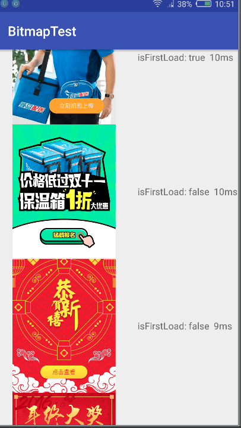

经过实际测试，缓存Bitmap到内存中的策略中，第一次加载图片时，快速滑动列表，会有明显卡顿；但在图片全部缓存后，页面无卡顿。

而缓存byte[]到内存中，在显示时才解码为Bitmap，第一次加载图片时，快速滑动列表，会有明细卡顿；byte[]全部缓存后，普通滑动速度几乎无卡顿；快速滑动有卡顿感。

所以从用户体验的角度上来说，缓存byte[]可能并不适合在图片列表这样可以快速滑动的场景代替Bitmap缓存。
而在ViewPager这样的场景，因为页面转换不可能像列表一样快速，byte[] - Bitmap所消耗的时间几乎无感，似乎适合。
但在页面展示如此迟钝的场景，似乎直接从文件中加载Bitmap才是最优的选择。

关于缓存替代品byte[] - Bitmap，仁者见仁智者见智吧。

（要提一点，为了避免byte[] - Bitmap的过程中产生大量的临时Bitmap对象，缓存byte[]的策略中应用了`inBitmap`属性，而这一属性的使用几乎不会影响到Bitmap的加载速度）


